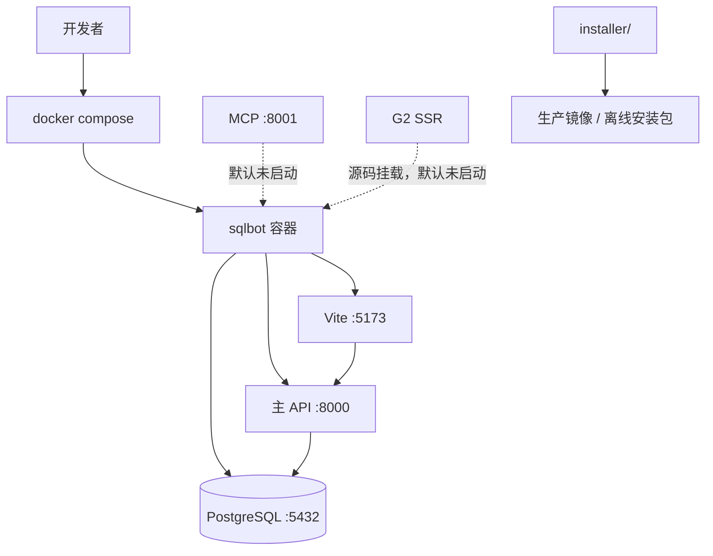

# 部署拓扑与运行方式

> 状态：Current
> 最后验证：2026-08-08
> 适用范围：本地 Docker 开发、应用服务端口与生产构建入口。
> 事实来源：`docker-compose.yml`、`Dockerfile-base`、`installer/`、`docs/deployment/docker-build-and-deploy.md`。

## 开发与生产边界

- 开发：先构建 `sqlbot-python-pg:local`，再通过根目录 `docker-compose.yml` 启动单个源码挂载容器；默认命令仅运行 PostgreSQL、主 API 和 Vite。
- MCP：`8001` 为预留端口映射，但 `main:mcp_app` 默认未由 Compose 启动；需要 MCP 时应单独启动该应用并验证端口。
- G2 SSR：源码会挂载到容器，但默认开发命令不启动 SSR 进程。
- 生产：镜像、离线包、安装、升级与卸载流程以 `installer/` 及 [部署与构建手册](../deployment/docker-build-and-deploy.md) 为准。
- 运行时持久化目录为 `data/`；不得将真实数据、模型缓存或日志误提交到仓库。

部署命令、环境变量和验证步骤不在本页重复，统一维护于 [部署与构建手册](../deployment/docker-build-and-deploy.md)。
