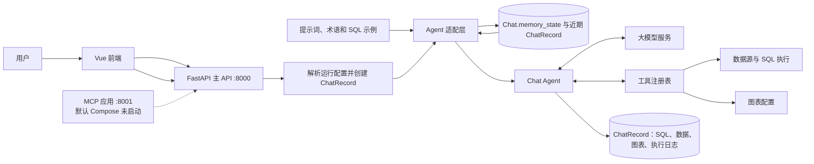

# 系统架构概览

> 状态：Current  
> 最后验证：2026-08-08  
> 适用范围：当前社区二次开发版本的运行时模块边界。  
> 事实来源：`backend/main.py`、`backend/apps/chat/`、`frontend/src/`、`docker-compose.yml`、`installer/`。

## 系统边界

SQLBot 是面向关系型数据源的对话式分析系统。浏览器端发送问题后，后端以 Agent 方式探索元数据、生成或编辑 SQL、在权限约束下查询数据，并以 SSE 返回文本、表格、图表及执行过程。分析和预测基于已有查询记录创建独立子记录。

## 模块职责

| 模块 | 职责 | 主要位置 |
|---|---|---|
| 前端 | 聊天、管理、SSE 消费、图表渲染 | `frontend/src/` |
| 主 API | 鉴权、业务路由、聊天入口 | `backend/main.py`、`backend/apps/` |
| Chat Agent | QA、分析、预测 Profile，工具循环与事件转发 | `backend/apps/chat/agent/` |
| 业务上下文 | 数据源、术语、训练 SQL、模板、权限 | `backend/apps/datasource/`、`terminology/`、`data_training/`、`template/` |
| 数据访问 | 多数据库方言、SQL 执行与连接管理 | `backend/apps/db/` |
| 持久化 | 用户、工作空间、对话、问答记录、配置与迁移 | PostgreSQL、SQLModel、`backend/alembic/` |
| 图表服务 | 前端图表；`g2-ssr/` 为可选 PNG 渲染组件，默认开发命令不启动 | `frontend/`、`g2-ssr/` |
| 集成 | MCP 暴露、嵌入式等接口 | `backend/main.py`、`backend/apps/mcp/` |

## 关键边界

- 默认问答入口使用 `apps.chat.agent.adapter.stream_agent()`；旧 `task/llm.py` 仍承担配置解析和兼容职责，不是默认问答编排器。
- 运行时权限、用户、工作空间和数据源上下文必须由 API/服务层注入，Agent 工具不能绕过这些边界。
- 图表类型以 `backend/apps/chat/agent/chart_registry.py` 为唯一配置源，后端校验和前端渲染必须同步。
- 本地 Docker 开发使用本地基座镜像和源码挂载；生产构建与离线安装由 `installer/` 管理。

进一步的请求链路见 [chat-agent-flow.md](chat-agent-flow.md)，持久化职责见 [state-and-storage.md](state-and-storage.md)，部署关系见 [deployment-topology.md](deployment-topology.md)。
