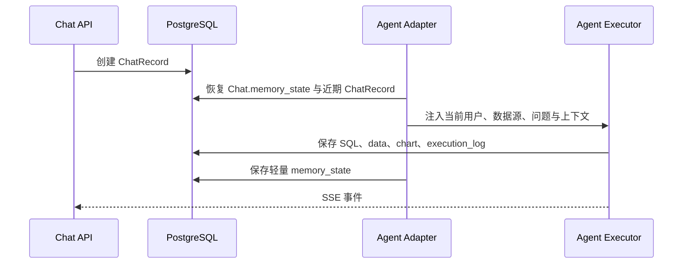

# 对话状态与持久化边界

> 状态：Current  
> 最后验证：2026-08-08  
> 适用范围：Chat Agent 的跨轮次状态、查询结果和执行记录。  
> 事实来源：`backend/apps/chat/models/chat_model.py`、`agent/adapter.py`、`agent/memory.py`、`agent/executor.py`。

## 职责划分

| 载体 | 保存内容 | 不应保存的内容 |
|---|---|---|
| `Chat.memory_state` | 可恢复的轻量 Agent 元数据、当前上下文索引 | 完整查询结果行、内部工具消息全文 |
| `ChatRecord` | 一轮问题、SQL、查询数据、图表、分析/预测结果、执行日志 | 跨会话的全局 Agent 状态 |
| 运行时 `AgentMemory` | 本轮工具调用、会话恢复后的可用元数据、运行时依赖 | 作为共享 LangGraph Checkpointer 的替代品 |

## 不使用 LangGraph Checkpointer

当前实现不使用共享 LangGraph Checkpointer。跨轮次上下文由适配层从数据库受控恢复，避免上一轮内部 tool message 直接进入下一轮模型上下文或跨权限边界泄露。任何拟改为 Checkpointer 的方案必须先建立 ADR，并补充跨用户、跨工作空间及工具消息泄露测试。

## 变更检查

- 新增跨轮次字段时，先判断它属于 `memory_state` 还是 `ChatRecord`。
- 新增结果展示或图表重渲染能力时，确认结果从 `ChatRecord.data` 恢复。
- 变更序列化、迁移或上下文恢复逻辑时，补充跨轮次、刷新恢复和权限隔离测试。
